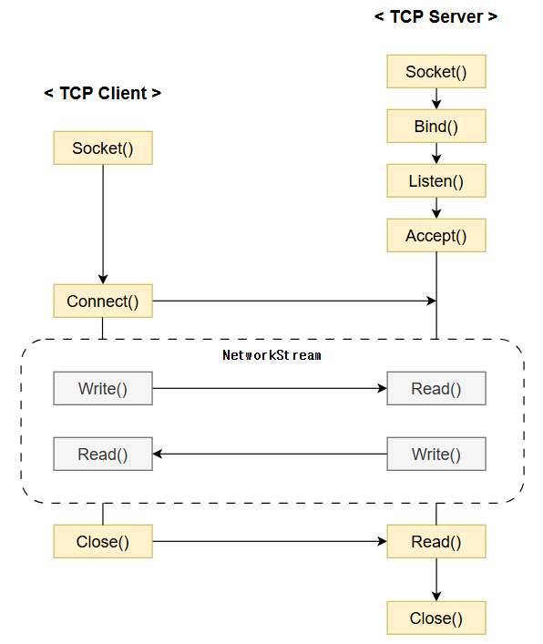

# w5500-ethernet
#### W5500 module library for various development boards

MCU <--SPI--> **W5500 Module** <--Ethernet (TCP/IP)--> PC (C# Winform)

```
SPI 연결 확인 레지스터
0x0039 Register : Chip version (0x04)
Data Frame : Address (2-byte) + Ctrl (1-byte) + Data (1-byte)
return : w5500_ReadVersion(W5500_VERSION_REGISTER, W5500_VERSION) ? 1 : 0;
```



```
CMD 창의 이더넷 어댑터 이더넷: 부분의 IP를 확인
1. IP Address : 169.254.202.190
2. Port : 502 (Modbus)
3. Hardware Address(MAC)
4. 다른 네트워크 : Gateway Address + Subnet Mask
5. Connect : while (client.connected())
```

## Common Register Block (공통 설정)
| 구분    | Register                                | 주소              | 기능                               |
| ----- | --------------------------------------- | --------------- | -------------------------------- |
| **1** | **MR (Mode Register)**                  | `0x0000`        | 소프트리셋, Ping Block, PPPoE 등 전역 제어 |
| **2** | **GAR[0:3] (Gateway Address)**          | `0x0001~0x0004` | 게이트웨이 IP 설정 (예: 192.168.0.1)     |
| **3** | **SUBR[0:3] (Subnet Mask)**             | `0x0005~0x0008` | 서브넷 마스크 설정 (예: 255.255.255.0)    |
| **4** | **SHAR[0:5] (Source Hardware Address)** | `0x0009~0x000E` | MAC 주소 설정 (예: 00:08:DC:01:02:03) |
| **5** | **SIPR[0:3] (Source IP Address)**       | `0x000F~0x0012` | 자신의 IP 설정 (예: 192.168.0.2)       |
| **6** | **PHYCFGR (PHY Config Register)**       | `0x002E`        | PHY 링크, 속도, 듀플렉스 확인 및 설정         |
| **7** | **VERSIONR (Chip Version Register)**    | `0x0039`        | 칩 버전 확인용 (0x04 expected)         |

## Socket n Register Block (통신 소켓별 설정)
| 구분     | Register                                      | 주소 (Socket 0 기준)  | 기능                                  |
| ------ | --------------------------------------------- | ----------------- | ----------------------------------- |
| **1**  | **Sn_MR (Mode Register)**                     | `0x0000`          | 소켓 동작 모드 (TCP=0x01, UDP=0x02)       |
| **2**  | **Sn_PORT[0:1]**                              | `0x0004~0x0005`   | 로컬 포트 번호 설정                         |
| **3**  | **Sn_DIPR[0:3]**                              | `0x000C~0x000F`   | 목적지 IP 주소 (TCP Client/UDP 송신용)      |
| **4**  | **Sn_DPORT[0:1]**                             | `0x0010~0x0011`   | 목적지 포트 (TCP Client/UDP 송신용)         |
| **5**  | **Sn_CR (Command Register)**                  | `0x0001`          | 명령 수행 (OPEN, CONNECT, SEND, RECV 등) |
| **6**  | **Sn_SR (Status Register)**                   | `0x0003`          | 소켓 상태 확인 (INIT, ESTABLISHED 등)      |
| **7**  | **Sn_TXBUF_SIZE / Sn_RXBUF_SIZE**             | `0x001F / 0x001E` | 송수신 버퍼 크기 설정 (2KB 기본)               |
| **8**  | **Sn_TX_WR / Sn_TX_RD / Sn_RX_RD / Sn_RX_WR** | `0x0024~0x002B`   | 데이터 포인터 관리                          |
| **9**  | **Sn_TX_FSR / Sn_RX_RSR**                     | `0x0020~0x0027`   | 버퍼 사용 가능한 크기 확인                     |
| **10** | **Sn_IR / Sn_IMR**                            | `0x0002 / 0x002C` | 인터럽트 플래그 및 마스크 제어                   |

## 초기화 순서
| 단계               | 설정                                                                          | 관련 레지스터       | 예시       |
| ---------------- | --------------------------------------------------------------------------- | ------------- | -------- |
| **① 리셋**         | MR[RST]=1 → 0                                                               | MR (0x0000)   | SW Reset |
| **② 네트워크 정보 설정** | GAR, SUBR, SHAR, SIPR                                                       | IP/MAC 환경 설정  |          |
| **③ 소켓 오픈**      | Sn_MR, Sn_PORT → Sn_CR(OPEN)                                                | TCP/UDP 모드 설정 |          |
| **④ 연결/리스닝**     | TCP Client: Sn_DIPR, Sn_DPORT → Sn_CR(CONNECT)<br>TCP Server: Sn_CR(LISTEN) | Sn_SR 상태 확인   |          |
| **⑤ 송수신 처리**     | Sn_TX_WR, Sn_RX_RD, Sn_CR(SEND/RECV)                                        | 데이터 버퍼 접근     |          |
| **⑥ 상태 감시**      | Sn_SR, Sn_IR                                                                | 연결 유지, 종료 감시  |          |

```
┌───────────────────────────────────────────┐
│                RESET 단계                  │
│ MR[RST]=1 → 0  (Soft Reset, RCW1)         │
│ 내부 레지스터 기본값으로 초기화, PHY 재설정     │
└───────────────┬───────────────────────────┘
                │
                ▼
┌───────────────────────────────────────────┐
│         네트워크 정보 설정 단계              │
│ GAR (Gateway), SUBR (Subnet)              │
│ SHAR (MAC), SIPR (Source IP)              │
│ → 시스템 IP/MAC 환경 구성                   │
└───────────────┬───────────────────────────┘
                │
                ▼
┌───────────────────────────────────────────┐
│             소켓 오픈 단계                  │
│ Sn_MR = TCP/UDP 설정                       │
│ Sn_PORT = 로컬 포트                        │
│ Sn_CR = OPEN → Sn_SR 상태 확인             │
└───────────────┬───────────────────────────┘
                │
                ▼
┌───────────────────────────────────────────┐
│          연결 또는 리스닝 단계               │
│ TCP Client: Sn_DIPR, Sn_DPORT → CONNECT   │
│ TCP Server: Sn_CR = LISTEN                │
│ Sn_SR = SOCK_ESTABLISHED 확인              │
└───────────────┬───────────────────────────┘
                │
                ▼
┌───────────────────────────────────────────┐
│           송수신 처리 단계                  │
│ ① 송신: SEND 시퀀스 (아래 참고)              │
│ ② 수신: RECV 시퀀스 (아래 참고)              │
└───────────────┬───────────────────────────┘
                │
                ▼
┌───────────────────────────────────────────┐
│              상태 감시 단계                 │
│ Sn_SR, Sn_IR 상태 감시                     │
│ 연결 종료, 에러, 타임아웃 감시                │
└───────────────────────────────────────────┘
```
### 송수신 처리 단계
```
     TX Buffer                           RX Buffer
┌──────────────────────────┐   ┌──────────────────────────┐
│Sn_TX_RD  → 송신완료된 데이터    │Sn_RX_RD  → 이미 읽은 위치  │
│Sn_TX_WR  → 새로 저장할 위치    │Sn_RX_WR  → 새로 수신된 위치 │
└──────────────────────────┘   └──────────────────────────┘

SEND 명령 → TX_RD ← TX_WR 동기화 (자동 증가)
RECV 명령 → RX_RD ← RX_WR 동기화 (수동 증가 후 RECV)
```
#### Tx 동작 시퀀스
```
[STEP 1] 전송 가능 확인
  Sn_TX_FSR (Free Size Register) 읽기
   └─ 보낼 데이터 크기 <= Sn_TX_FSR 이어야 함

[STEP 2] 쓰기 시작 주소 확보
  wr0 = Sn_TX_WR (Write Pointer) 읽기

[STEP 3] 데이터 버퍼 쓰기
  TX Buffer (Sn_TX_WR 주소 기준)에 데이터 저장
   └─ 주소 범위: wr0 ~ wr0 + len - 1

[STEP 4] 포인터 갱신
  Sn_TX_WR = wr0 + len (carry 무시, 16bit 순환)
   └─ w5500_WriteBuff(W5500_Sn_TX_WR, ...) 사용

[STEP 5] 전송 명령
  Sn_CR = SEND → 자동 clear 후 송신 완료
   └─ 완료 시 Sn_IR(SEND_OK)=1 (interrupt 발생)
```
#### Rx 동작 시퀀스
```
[STEP 1] 수신 데이터 확인
  Sn_RX_RSR (Received Size Register) 2번 읽기
   └─ 수신된 데이터 크기 확인

[STEP 2] 읽기 시작 주소 확보
  rd0 = Sn_RX_RD (Read Pointer) 읽기

[STEP 3] RX Buffer에서 데이터 읽기
  RX Buffer (rd0 기준)에서 len 만큼 읽기
   └─ 주소 범위: rd0 ~ rd0 + len - 1

[STEP 4] 포인터 갱신
  Sn_RX_RD = rd0 + len (16bit 순환)
   └─ w5500_WriteBuff(W5500_Sn_RX_RD, ...) 사용

[STEP 5] 읽기 완료 명령
  Sn_CR = RECV → 내부적으로 데이터 제거 처리
```